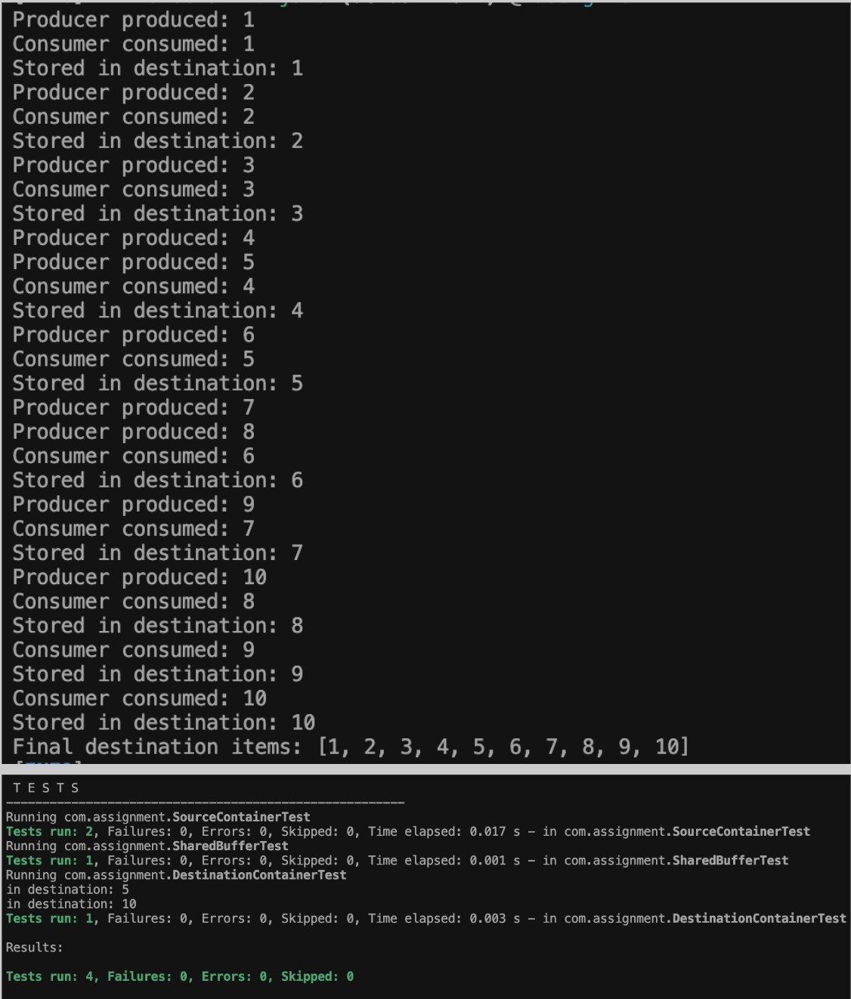
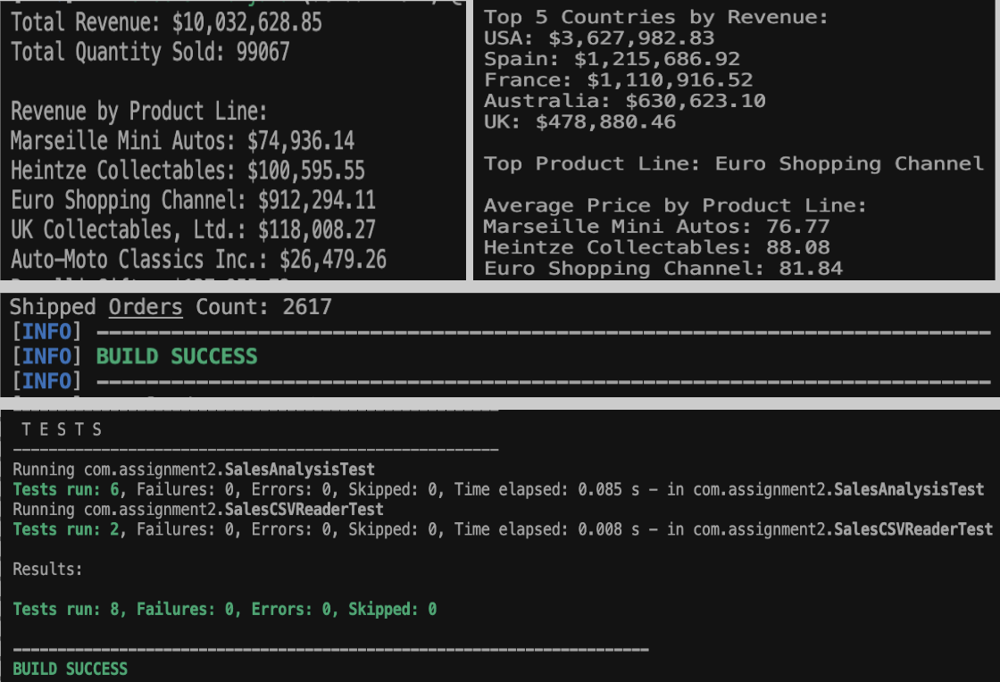

# Intuit Build Challenge – Assignment 1 & Assignment 2

This repository contains two Java programming assignments demonstrating concurrent programming patterns and functional programming with streams.

---

## Assignment 1 — Producer–Consumer Pattern (Java)

This project implements the classic Producer–Consumer pattern using Java threads and a shared blocking queue. The producer retrieves items from a source container and places them into a shared buffer, while the consumer reads these items from the buffer and stores them into a destination container.

### Features

- Multi-threaded Producer and Consumer implementation
- Thread synchronization using BlockingQueue
- Shared buffer with fixed capacity
- Custom Source and Destination containers
- Maven project structure
- JUnit 5 unit tests for all major components

### Project Structure

```
assignment1/
├── src/main/java/com/assignment/
│   ├── Main.java
│   ├── Producer.java
│   ├── Consumer.java
│   ├── SharedBuffer.java
│   ├── SourceContainer.java
│   └── DestinationContainer.java
└── src/test/java/com/assignment/
    ├── SourceContainerTest.java
    ├── DestinationContainerTest.java
    └── SharedBufferTest.java
```

### Requirements Covered

- Producer–Consumer pattern implementation
- Thread synchronization using BlockingQueue
- Concurrent programming with multiple threads
- Proper shared resource handling
- Unit tests covering all main components

### How to Run the Program

1. Navigate to the assignment1 directory:
   ```bash
   cd assignment1
   ```

2. Compile the project:
   ```bash
   mvn clean package
   ```

3. Run the application:
   ```bash
   mvn exec:java
   ```

### How to Run Unit Tests

Execute all tests using:
```bash
mvn test
```

### Sample Output

```
Producer produced: 1
Consumer consumed: 1
Stored in destination: 1
Producer produced: 2
Consumer consumed: 2
Stored in destination: 2
...
Final destination items: [1, 2, 3, 4, 5, 6, 7, 8, 9, 10]
```

### Output Screenshot



### Technologies Used

- Java 17
- Maven
- JUnit 5
- ArrayBlockingQueue
- Java Threads

### Conclusion

- Demonstrates a correct and synchronized producer–consumer workflow.
- Producer reads values from the SourceContainer and places them into the shared buffer.
- Consumer retrieves and stores processed values into the DestinationContainer.
- Thread safety is ensured using a BlockingQueue, which internally manages waiting, blocking, and notifications.

---

## Assignment 2 – Sales Data Analysis Using Java Streams, Functional Programming & OpenCSV

This project analyzes a real-world sales dataset using **Java Streams**, **functional programming**, and **OpenCSV** for accurate CSV parsing. The goal is to implement aggregation, grouping, filtering, and sorting operations using the Streams API while working with a non-trivial dataset.

### Overview

The application performs the following operations:

- Reads and loads a CSV dataset (`sales_data_sample.csv`)
- Parses rows into Java objects (`SalesRecord`)
- Performs various analytics using Java Streams:
  - Total revenue
  - Total quantity sold
  - Top 5 countries by revenue
  - Revenue by product line
  - Average price by product line
  - Count of shipped orders
  - Top-selling product line
- Prints all results in a clear, formatted console output

### Dataset Information

**File:** `sales_data_sample.csv`  
**Rows:** ~2823 records  
**Columns Used in This Assignment:**

- ORDERNUMBER
- QUANTITYORDERED
- PRICEEACH
- SALES
- ORDERDATE
- STATUS
- PRODUCTLINE
- COUNTRY
- DEALSIZE

The CSV is placed under:
```
assignment2/src/main/resources/sales_data_sample.csv
```

### Project Structure

```
assignment2/
├── src/main/java/com/assignment2/
│   ├── Main.java
│   ├── SalesRecord.java
│   ├── SalesCSVReader.java
│   └── SalesAnalysis.java
├── src/main/resources/
│   └── sales_data_sample.csv
└── src/test/java/com/assignment2/
    ├── SalesCSVReaderTest.java
    └── SalesAnalysisTest.java
```

### Technologies Used

- Java 17
- Maven
- OpenCSV 5.7.1
- Java Streams API
- Functional Programming Concepts (map/filter/reduce/grouping)
- exec-maven-plugin
- JUnit 5 for testing

### How to Run the Project

1. Navigate to the assignment2 directory:
   ```bash
   cd assignment2
   ```

2. Build the project:
   ```bash
   mvn clean package
   ```

3. Run the program:
   ```bash
   mvn exec:java
   ```

The program will automatically run `com.assignment2.Main`.

### Unit Testing (JUnit 5)

This project includes comprehensive unit tests to validate:

- Successful CSV loading
- Preprocessing correctness
- Revenue calculations
- Revenue by product line
- Top 5 countries by revenue
- Average price calculations
- Filtering logic (e.g., shipped orders)

#### Test Files:
```
src/test/java/com/assignment2/SalesCSVReaderTest.java
src/test/java/com/assignment2/SalesAnalysisTest.java
```

#### Run all tests:
```bash
mvn test
```

### Functional Requirements Implemented

#### Data Loading & Parsing
- CSV loaded using OpenCSV
- Handles quoted fields and commas inside values
- Maps rows to `SalesRecord` POJOs

#### Stream-Based Operations
- `map`, `filter`, `sorted`, `limit`, `collect`, `groupingBy`, `mapToDouble`, `mapToInt`
- Method references (`Class::method`)
- Chained Stream pipelines

#### Analytics
- Total revenue
- Total quantity sold
- Revenue grouped by product line
- Top 5 countries by revenue (sorted descending)
- Average price by product line
- Count of shipped records
- Best-performing product line

### Sample Output

```
=== Sales Data Analysis ===

Total Revenue: $10,032,628.85
Total Quantity Sold: 99,096 units

Top 5 Countries by Revenue:
1. USA: $3,627,982.83
2. Spain: $1,215,686.92
3. France: $1,110,916.52
...

Revenue by Product Line:
- Classic Cars: $3,919,615.66
- Vintage Cars: $1,903,150.84
...
```

### Output Screenshot



### Maven Dependencies (Already Configured in pom.xml)

- `opencsv` — CSV parsing
- `maven-surefire-plugin` — JUnit 5 support
- `exec-maven-plugin` — run Main
- `junit-jupiter` — tests

### Conclusion

This assignment demonstrates:

- Clean and modular Java programming
- Correct handling of real-world CSV data
- Functional programming with Streams
- Grouping, aggregation, filtering, and sorting
- Practical use of OpenCSV
- Clear, formatted analytical output

---

## Repository Structure

```
.
├── assignment1/
│   ├── src/
│   ├── pom.xml
│   └── README.md
├── assignment2/
│   ├── src/
│   ├── pom.xml
│   └── README.md
├── screenshots/
│   ├── assignment1_output.png
│   └── assignment2_output.png
└── README.md (this file)
```

## Getting Started

1. Clone the repository:
   ```bash
   git clone <repository-url>
   cd <repository-name>
   ```

2. Navigate to the desired assignment directory and follow the instructions above.

## Requirements

- Java 17 or higher
- Maven 3.6 or higher

## Author

[Your Name]

## License

This project is part of academic coursework.
